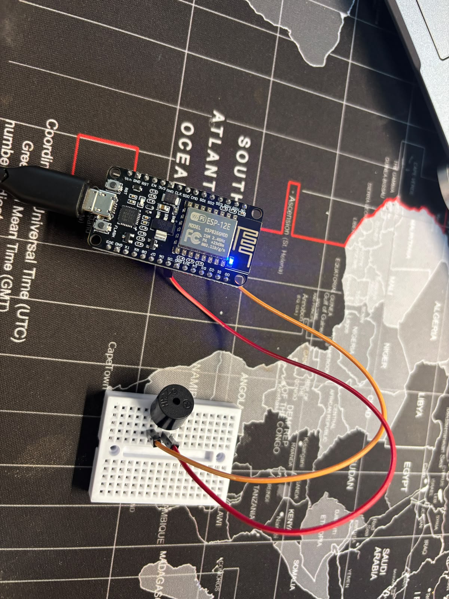

# 🔔 Buzzer Alert using NodeMCU ESP8266

A simple IoT project that demonstrates how to control an active buzzer using the NodeMCU ESP8266. The buzzer generates a short beep sequence when the microcontroller starts.

---

## 📌 Overview

This project plays a beep pattern during startup using an active buzzer connected to the NodeMCU ESP8266. It is a beginner-friendly project for learning digital output control.

---

## 🛠️ Components Used

- NodeMCU ESP8266
- Active Buzzer
- Breadboard
- Jumper Wires
- USB Cable

---

## 🔌 Circuit Connections

| NodeMCU | Component |
|---------|-----------|
| D5 (GPIO14) | Buzzer Signal (+) |
| GND | Buzzer GND (-) |

---

## ⚙️ Working Principle

1. NodeMCU initializes the buzzer pin as an output.
2. A 1000 Hz tone is generated.
3. The buzzer sounds for 300 ms.
4. The buzzer stops for 300 ms.
5. The sequence runs once during startup.

---

## 📷 Circuit Diagram

  

---

## 🚀 How to Run

1. Open `02_Buzzer_Alert.ino` in Arduino IDE.
2. Select **NodeMCU 1.0 (ESP-12E Module)**.
3. Choose the correct COM Port.
4. Upload the code.
5. The buzzer will beep once after startup.

This project is licensed under the MIT License.
