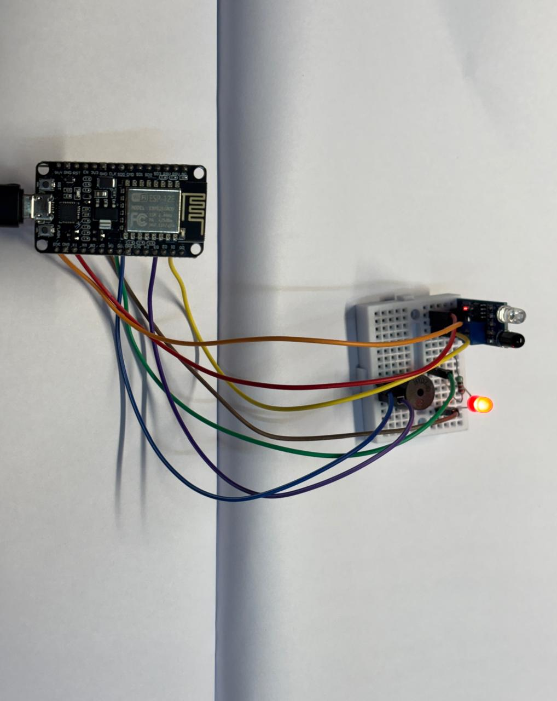

# 🚧 Smart Obstacle Detector using NodeMCU ESP8266 & IR Sensor

A NodeMCU ESP8266-based obstacle detection system that uses an **IR sensor** to detect nearby objects and provides instant visual and audible feedback through an **LED** and **buzzer**. This project demonstrates real-time digital sensor interfacing and event-driven control in embedded systems.

---

## 🛠 Components Used

- NodeMCU ESP8266
- IR Obstacle Detection Sensor
- LED
- 220Ω Resistor
- Active Buzzer
- Breadboard
- Jumper Wires
- Micro USB Cable

---

## 🔌 Circuit Connections

| NodeMCU Pin | Component |
|-------------|-----------|
| D1 (GPIO5)  | IR Sensor OUT |
| 3.3V        | IR Sensor VCC |
| GND         | IR Sensor GND |
| D2 (GPIO4)  | Buzzer (+) |
| D5 (GPIO14) | LED Anode (+) |
| GND         | LED Cathode (via 220Ω Resistor) |

---

## 📸 Project Setup

  

---

## ⚙️ Working Principle

1. The IR sensor continuously monitors its surroundings for nearby objects.
2. When an object enters the sensor's detection range, the sensor output changes state.
3. The NodeMCU reads this digital signal in real time.
4. Upon detecting an obstacle, the LED turns ON and the buzzer sounds to indicate detection.
5. When the object moves away, both the LED and buzzer automatically turn OFF.

---

## ✨ Features

- Real-time obstacle detection
- Visual indication using an LED
- Audible alert using a buzzer
- Fast digital sensor response
- Simple and beginner-friendly implementation

---

## 💻 Software Used

- Arduino IDE
- Arduino C++

---

## 📚 Concepts Covered

- NodeMCU ESP8266 Programming
- GPIO Digital Input & Output
- IR Sensor Interfacing
- Obstacle Detection
- Event-Driven Programming
- Conditional Statements (`if/else`)
- Serial Communication
- Embedded Systems Fundamentals

## 📄 License

This project is licensed under the MIT License.
