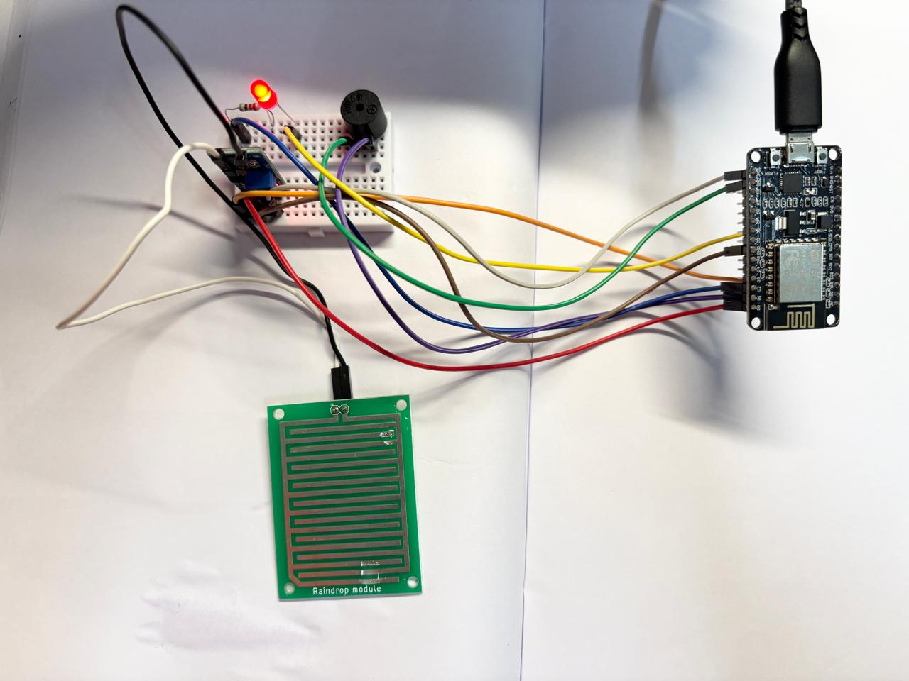

# 🌧️ Rain Detection Alert System using NodeMCU ESP8266

A NodeMCU ESP8266-based IoT project that detects rainfall using an analog rain sensor and provides immediate visual and audible alerts through an LED and buzzer. The system continuously monitors the sensor's output and activates the alert whenever rainfall exceeds a predefined threshold.

---

## 📸 Project Setup

  

---

## 🛠 Components Used

- NodeMCU ESP8266
- Rain Sensor Module
- Active Buzzer
- LED
- 220Ω Resistor
- Breadboard
- Jumper Wires
- Micro USB Cable

---

## 🔌 Circuit Connections

| NodeMCU Pin | Component |
|-------------|-----------|
| A0 | Rain Sensor AO |
| D1 | Active Buzzer |
| D2 | LED |
| 3.3V | Rain Sensor VCC |
| GND | Common Ground |

---

## ⚙️ Working Principle

1. The rain sensor continuously measures the amount of moisture on its sensing plate.
2. The NodeMCU reads the analog sensor value through the A0 pin.
3. If the sensor value falls below the predefined threshold, rainfall is detected.
4. The LED turns ON and the buzzer sounds to indicate rain.
5. When the sensor becomes dry again, both alerts are automatically turned OFF.

---

## ✨ Features

- Real-time rain detection
- Analog sensor monitoring
- Visual indication using an LED
- Audible alert using a buzzer
- Adjustable detection threshold
- Serial Monitor diagnostics

---

## 💻 Software Used

- Arduino IDE
- Arduino C++

---

## 📚 Concepts Covered

- NodeMCU ESP8266 Programming
- Analog Input (ADC)
- GPIO Digital Output
- Rain Sensor Interfacing
- Threshold-Based Automation
- Sensor Calibration
- Serial Communication
- Embedded Systems Programming

---

## 📄 License

This project is licensed under the MIT License.
