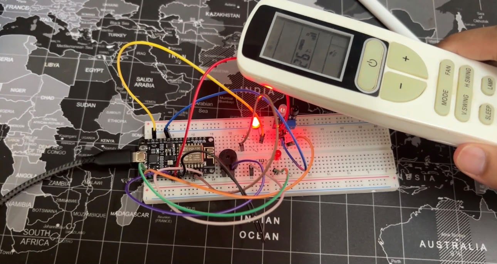

# IR-Based Intruder Alert System using NodeMCU ESP8266

An IR-based intruder alert system built using the NodeMCU ESP8266. The system detects an object using an IR sensor and activates a buzzer along with two flashing red LEDs as an audio and visual alert.

## 📌 Features

- IR-based object detection
- Two red LEDs for visual indication
- Buzzer for audio alert
- Automatic alarm activation when an object is detected
- Automatic return to normal state when the object leaves the detection range
- Serial Monitor status messages

## 🛠️ Components Used

- NodeMCU ESP8266
- IR Sensor
- 2 × Red LEDs
- 2 × Resistors
- Buzzer
- Breadboard
- Jumper Wires

## 💻 Software & Technologies

- Arduino IDE
- C++
- ESP8266
- Digital GPIO

## ⚙️ Working

The IR sensor continuously monitors its surroundings for an object within its sensing range.

When no object is detected, the system remains in its normal state with the LEDs and buzzer turned off.

When an object is detected:

1. The IR sensor sends a detection signal to the NodeMCU.
2. The NodeMCU processes the sensor input.
3. The two red LEDs flash alternately.
4. The buzzer is activated.
5. A detection message is displayed on the Serial Monitor.

Once the object moves away from the sensing range, the system automatically returns to its normal state.

## 📸 Project Demonstration

<p align="center">
  
</p> 

## 🔌 Circuit Connections

| Component | NodeMCU Pin |
|---|---|
| IR Sensor VCC | 3V3 |
| IR Sensor GND | GND |
| IR Sensor OUT | D5 |
| LED 1 | D1 |
| LED 2 | D2 |
| Buzzer + | D6 |
| Buzzer - | GND |

Both LEDs are connected through appropriate resistors.

## 🔄 System Workflow

```text
          IR Sensor
              │
              ▼
      Object Detected?
         │         │
        YES        NO
         │         │
         ▼         ▼
      NodeMCU    System
      ESP8266    Normal
         │
    ┌────┴────┐
    ▼         ▼
  LEDs      Buzzer
 Flash        ON
